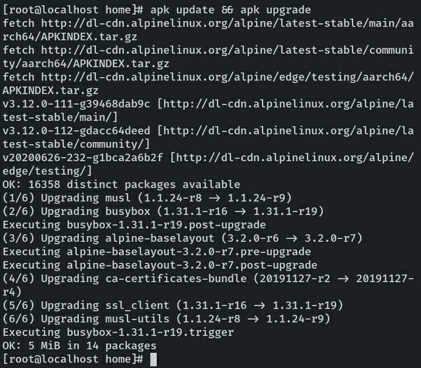
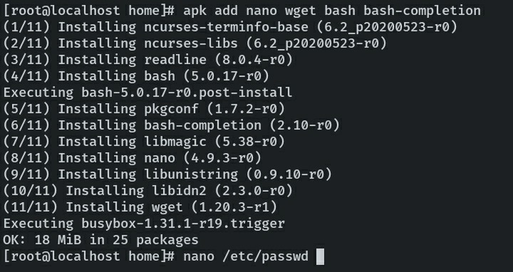
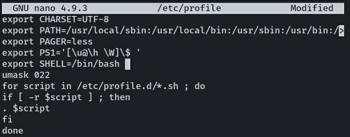
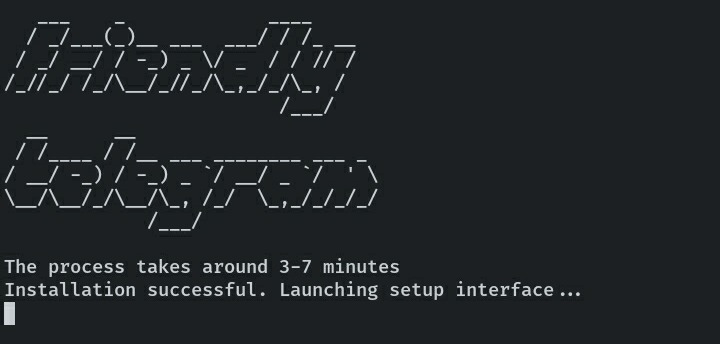
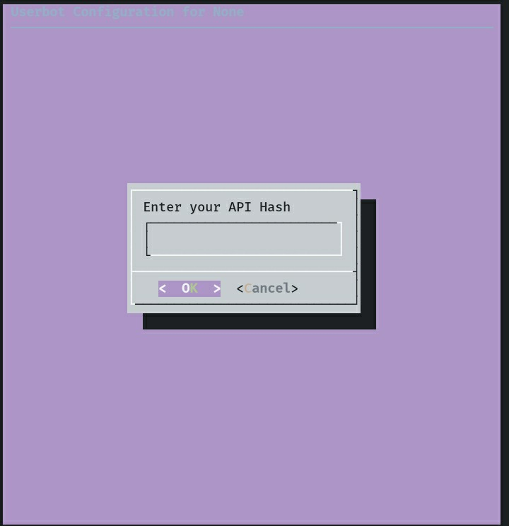

-----
- [Source code on Gitlab](https://gitlab.com/friendly-telegram)
- [Author](https://gitlab.com/hackintosh5)
-----

## Инфо
1. Это всё делалось для себя.
2. Мод предназначен для тех, кто уже пользовался юзерботом.
3. Установщик PowerShell сломан. С винды не поставите никак. Ссылка на оригинал выше.
### Изменено/Дополнено:
- Добавлена поддержка iOS на Alpine Linux iSh. 
- Кастомный звук Выключения/Включения (Windows 7).
- Фикс ошибки SSL, которая начала появляться у некоторых пользователей с Termux.
- Русифицирован процесс получения кода по Web.
- Сразу ставит регион EU (Европа, пинг 30-50мс) в Heroku прямо во время установки.
- Ставит пакет neofetch по умолчанию. В Heroku нет доступа к пакетному менеджеру apt. (!²)
- Обновляется/устанавливается из этого репозитория.
- Возможно ещё будут и другие изменения.

### !
- (!) Подробный гайд для Alpine Linux ниже. Так как устройств на iOS у меня нет, пожалуйста, отпишитесь автору/в чат о результате, если даже никаких ошибок не было. А так же ищу добровольцев для дальнейших тестов.
- (!²) На стадии доработки. У большинства встречаются проблемы с конфигами.
Если `.neofetch` не реагирует, попробуйте это:
	`.terminal git clone https://github.com/dylanaraps/neofetch`
	`.terminal cd n* && make PREFIX=/app/.apt/usr install`
Слетит после повторного деплоя или перезагрузки, но пока что это оптимальное решение. 
[Источник](https://github.com/dylanaraps/neofetch/issues/1371)

### Установка:
- Только Termux: `(. <($(which curl>/dev/null&&echo curl -Ls||echo wget -qO-) https://kutt.it/ftgimod) --no-web)`
Вводите APP_ID, API_HASH, номер телефона и код. Дождитесь запуска, когда напишет "Started for <id>".
Последующие запуски - `cd $HOME/friendly-telegram && python3 -m friendly-telegram`

- На Heroku через Termux: `(. <($(which curl>/dev/null&&echo curl -Ls||echo wget -qO-) https://kutt.it/ftgimod) --heroku --no-web)`
Начальный запуск идентичный с примером выше, только в этом случае Вам потребуется ещё и API Key (ключ) с сайта Heroku.

- Telegram App_ID и Api_hash - [Тут](https://my.telegram.org/apps)
- Heroku Api Key - [Тут](https://dashboard.heroku.com)

### Alpine Linux (iPhone iSh)
1. Обновляем список пакетов и сами пакеты.
	$`apk update && apk upgrade`
	
2. Скачиваем необходимые пакеты bash.
	$`apk add bash bash-completion sudo nano`
	
3. Используя nano (или любой другой редактор) открываем конфигурационный файл passwd в папке /etc.
	$`nano /etc/passwd`
	
Видим первую строку с нашем именем пользователя и путь к shell по умолчанию. В моем случае это `root`, потому что в системе нет других пользователей - `root:x:0:0:root:/root:/bin/ash`.
	
Заменяем `ash` (иногда может быть просто`sh`) => `bash`. Получится как-то так:
`root:x:0:0:root:/root:/bin/bash`
	
Сохраняем и идём дальше.
(! Не нужно обращаться к автору/чат поддержки с вопросами по типу _"Как редактировать?"_, _"Как сделать *что-то*_" и особенно с _"Что дальше?"_. В интернете сотни гайдов на эти темы. Пишите только в случае ошибки в самом скрипте или гайде.)
4. Редактируем теперь /etc/profile и добавим переменную SHELL ниже остальных переменных.
	$`nano /etc/profile` - добавим в список экспортов следующее: `export SHELL=/bin/bash`
	
5. Закрываем консоль командой **exit** и открываем, чтобы изменения уж точно сработали.
Проверим shell, в котором мы находимся: `echo "$OSTYPE`.
	
Получили **linux-musl**? Успех. Идём дальше.
А если пустота - значит где-то и что-то сделали не так. Повторите шаги 3-4.

6. Запуск установщика
	$`(. <($(which curl>/dev/null&&echo curl -Ls||echo wget -qO-) https://kutt.it/ftgimod) --heroku --no-web)`
	Так как это iOS, с локальным сервером могут быть проблемы и вообще мало кто будет держать бот на iPhone. Поэтому ставим на Heroku.
	
Выполняем команду и ждём, ждём, и снова ждём. 
7. И у нас хорошие новости :)
	
	
	
Вводим API_HASH, API_ID и Heroku API_KEY - логинимся.
И поздравляю, мы победили Купертино.
Проверяем `.ping` и вступаем в чат поддержки.

### Важно
- Поддержка мода & ЧаВо - https://t.me/wardsenz
- Если раньше не встречали/пользовались этим ботом, то пожалуйста, прочитайте оригинальную документацию [здесь](https://friendly-telegram.gitlab.io).
